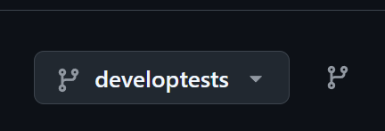

Subject: Completion of Take-Home Technical Assessment – Senior Position

Dated 25/07/2025

Dear Team,

I am writing to formally confirm the completion of the take-home technical assessment for the
Senior Developer position. The project has been implemented in strict accordance with 
the requirements and guidelines provided.

Github [url](https://github.com/dotnetappdev/pdscs)

Please note: A comprehensive README and detailed release notes are available in the repository to assist with setup, usage, and review.

Note ** only use this branch **
Branch Name : 

Key points of adherence include:
- All specified features and functionalities have been developed and tested.
- The codebase follows best practices for maintainability, readability, and scalability.
- Accessibility and responsive design standards have been observed throughout the user interface.
- Comprehensive documentation has been provided to facilitate review and future maintenance.
- All setup and environment instructions are included, with additional notes for common development issues.

Should you require any further information, clarification, or a demonstration of the solution,
please do not hesitate to contact me.

Thank you for the opportunity to complete this assessment. I look forward to your 
feedback and to discussing the next steps in the selection process.

Kind regards,

David Buckley

